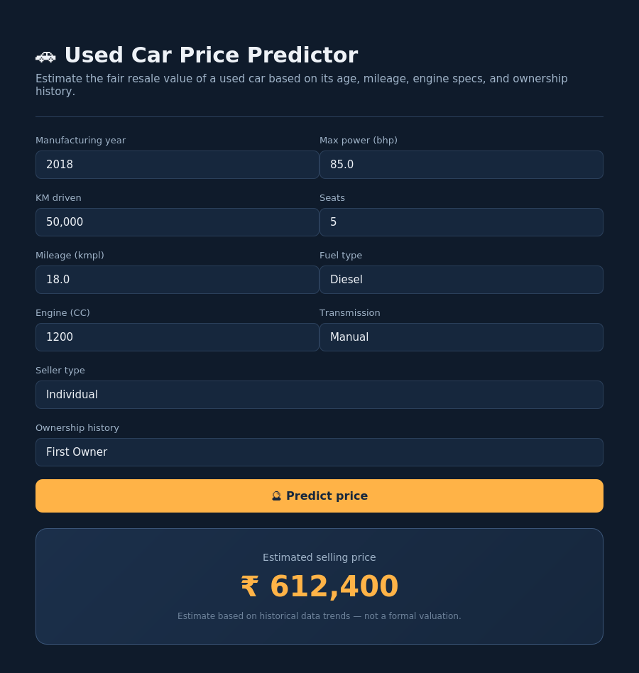
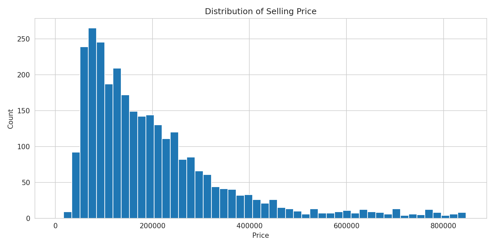
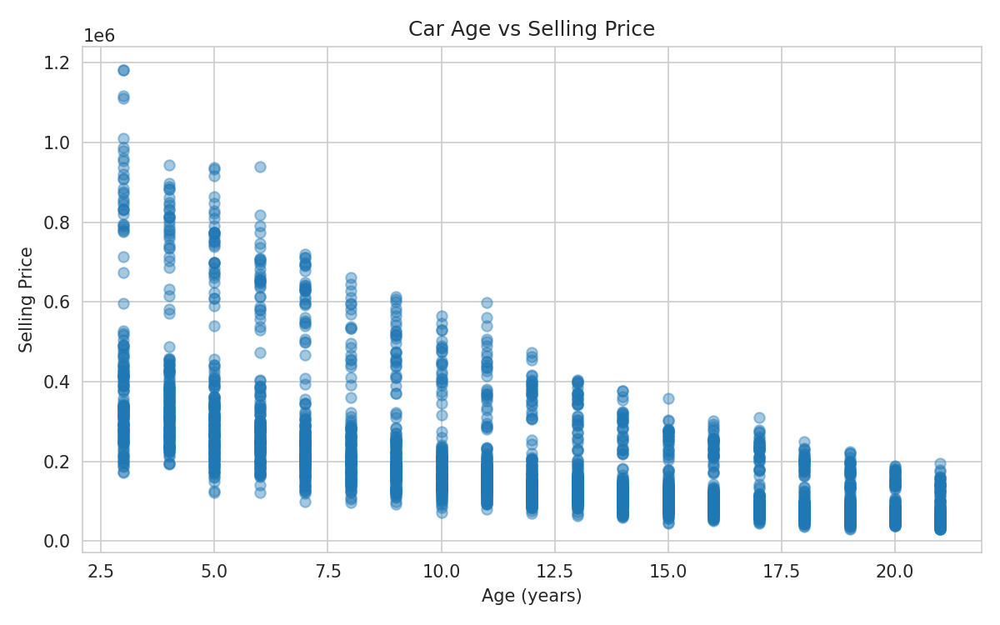
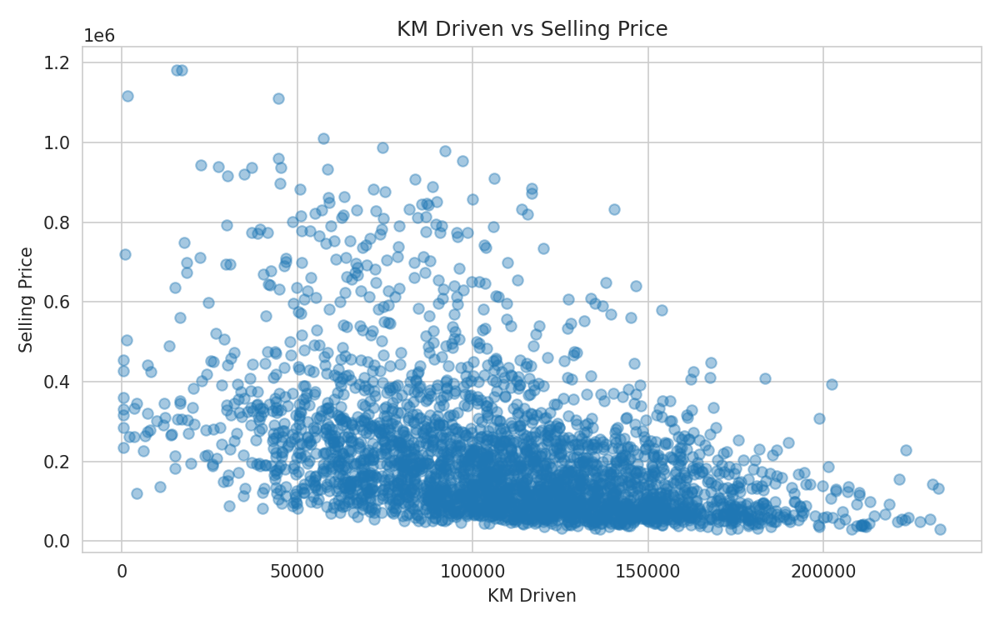
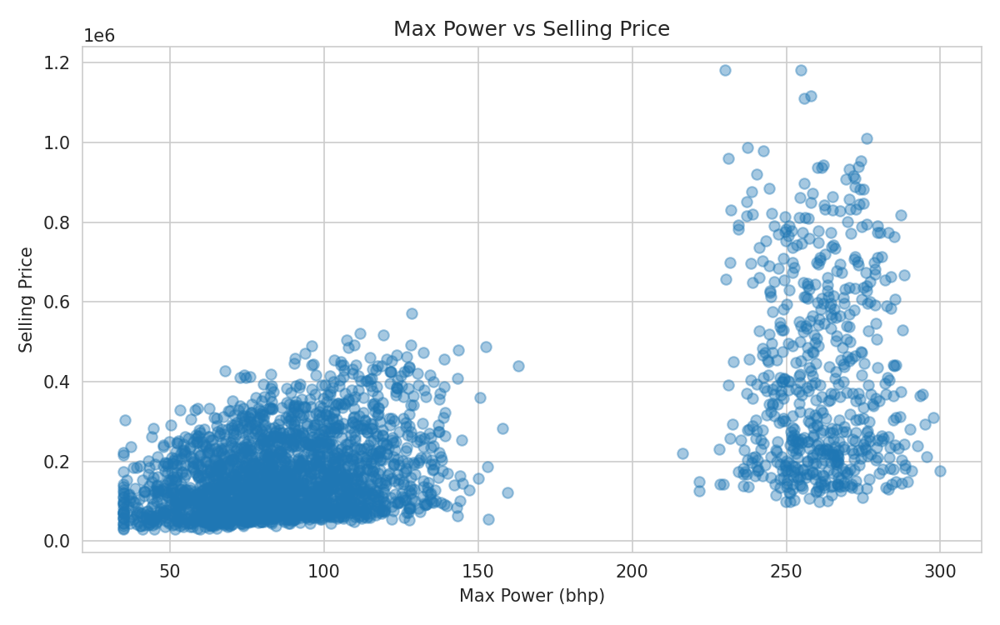
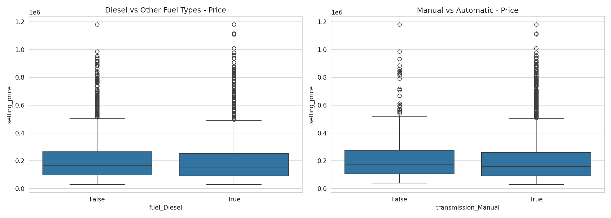
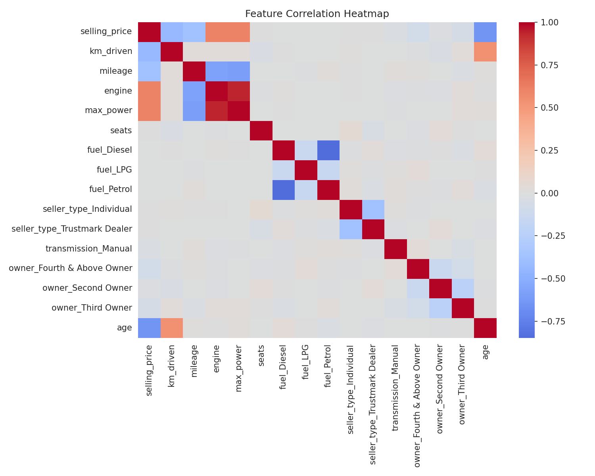
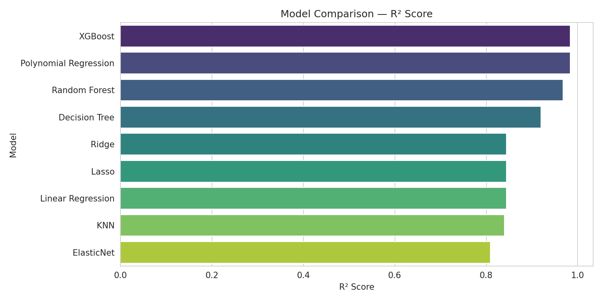
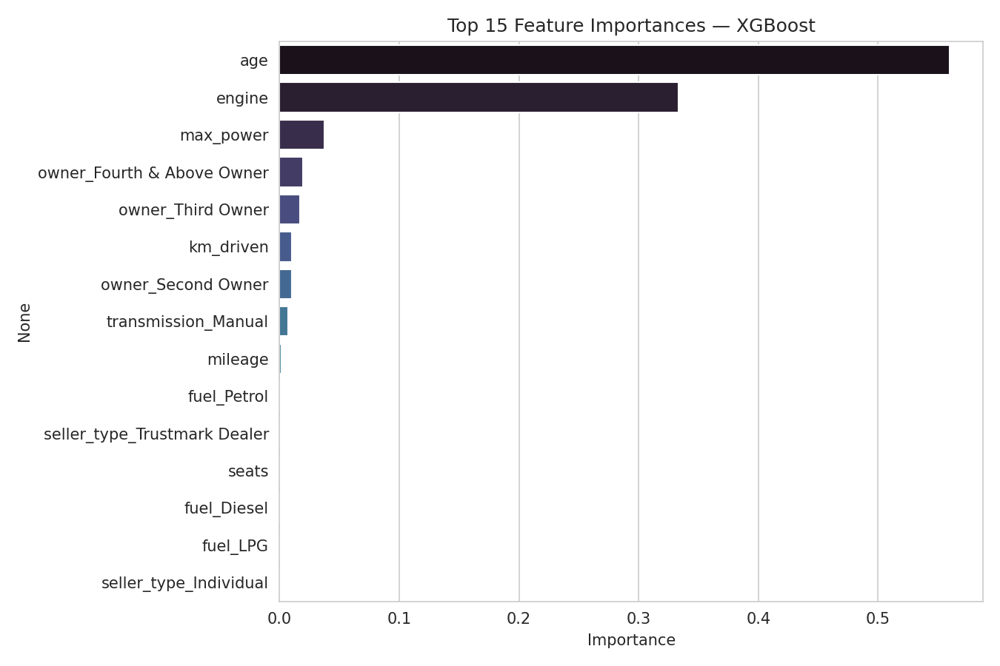

# Used Car Price Prediction

Predict the resale (selling) price of a used car from its age, mileage,
engine specs, fuel type, transmission, and ownership history — trained on
the [Vehicle Dataset from CarDekho](https://www.kaggle.com/datasets/nehalbirla/vehicle-dataset-from-cardekho)
and served through an interactive **Streamlit** app.

[](https://used-car-price-prediction-v1.streamlit.app/)

**Try it live: [used-car-price-prediction-v1.streamlit.app](https://used-car-price-prediction-v1.streamlit.app/)**



---

## Highlights

- End-to-end pipeline: cleaning → feature engineering → EDA → model comparison → deployment
- 9 regression models trained and compared (Linear, Ridge, Lasso, ElasticNet,
  Polynomial, Decision Tree, Random Forest, KNN, XGBoost)
- Best model auto-selected and exported for inference
- Interactive Streamlit app for instant price estimates
- Fully reproducible: a synthetic sample dataset is included so the project
  runs out of the box with no external downloads required

---

## Project Structure

```
used-car-price-prediction/
├── app/
│   └── streamlit_app.py          # Streamlit web app
├── data/
│   ├── generate_sample_data.py   # Generates a synthetic sample dataset
│   └── Car_details_v3.csv        # Sample data (replace with the real Kaggle dataset for production use)
├── models/
│   ├── best_model.pkl            # Best-performing trained model
│   ├── scaler.pkl                # Fitted StandardScaler
│   └── feature_columns.pkl       # Exact feature column order used at training time
├── notebooks/
│   └── used_car_price_prediction.ipynb   # Full training & analysis notebook
├── assets/                       # Charts & images used in this README
├── requirements.txt
└── README.md
```

---

## Dataset

This project is built around the schema of the **CarDekho Used Car dataset**:
`name, year, selling_price, km_driven, fuel, seller_type, transmission,
owner, mileage, engine, max_power, torque, seats`.

For convenience (and so the repo runs immediately after cloning), a
**synthetic sample dataset** with the same schema and realistic
relationships is generated by `data/generate_sample_data.py` and committed
at `data/Car_details_v3.csv`.

> For production-grade accuracy, download the real dataset from
> [Kaggle](https://www.kaggle.com/datasets/nehalbirla/vehicle-dataset-from-cardekho)
> and place it at `data/Car_details_v3.csv`, then re-run the notebook.

---

## Exploratory Data Analysis

| Selling price distribution | Age vs. selling price |
|:---:|:---:|
|  |  |

| KM driven vs. price | Max power vs. price |
|:---:|:---:|
|  |  |

| Fuel type & transmission vs. price | Feature correlation heatmap |
|:---:|:---:|
|  |  |

---

## Model Training & Comparison

Nine regression models were trained on the cleaned, scaled features and
evaluated on a held-out 20% test split using **R² Score** and **RMSE**.



| Model | R² Score | RMSE |
|---|---|---|
| **XGBoost** | **0.984** | **18,675** |
| Polynomial Regression | 0.984 | 18,735 |
| Random Forest | 0.968 | 26,549 |
| Decision Tree | 0.920 | 42,133 |
| Ridge | 0.844 | 58,726 |
| Lasso | 0.844 | 58,735 |
| Linear Regression | 0.844 | 58,736 |
| KNN | 0.840 | 59,471 |
| ElasticNet | 0.809 | 64,972 |

*(Results shown are on the included sample dataset — re-run the notebook
with the real dataset for production numbers.)*

The winning model is auto-selected by R² score and exported to
`models/best_model.pkl`, along with the fitted `scaler.pkl` and the
`feature_columns.pkl` order used for inference.

**Feature importance** (top predictors, from the best tree-based model):



---

## Streamlit App

The app (`app/streamlit_app.py`) loads the exported model artifacts and
lets a user enter a car's specs to get an instant price estimate.

**Live app: [used-car-price-prediction-v1.streamlit.app](https://used-car-price-prediction-v1.streamlit.app/)**


### Run locally

```bash
git clone https://github.com/muhammed-alaa74/used-car-price-prediction.git
cd used-car-price-prediction
pip install -r requirements.txt

# Optional: regenerate the sample dataset
python data/generate_sample_data.py

# Optional: re-train the model (outputs already included in models/)
jupyter nbconvert --to notebook --execute --inplace notebooks/used_car_price_prediction.ipynb

# Launch the app
streamlit run app/streamlit_app.py
```

The app will open at `http://localhost:8501`.

---


---

## License

This project is open-sourced for educational purposes. The original dataset
is provided by [CarDekho via Kaggle](https://www.kaggle.com/datasets/nehalbirla/vehicle-dataset-from-cardekho)
under its own license terms.
